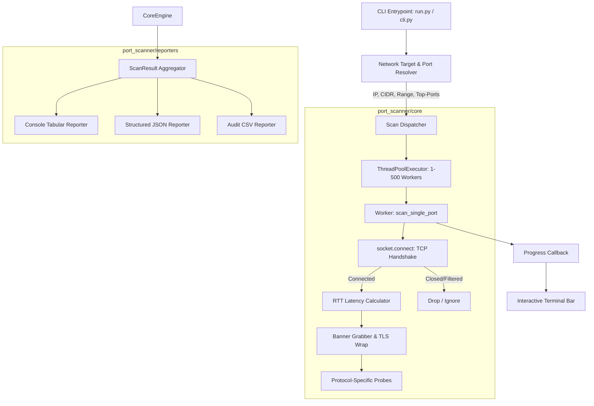
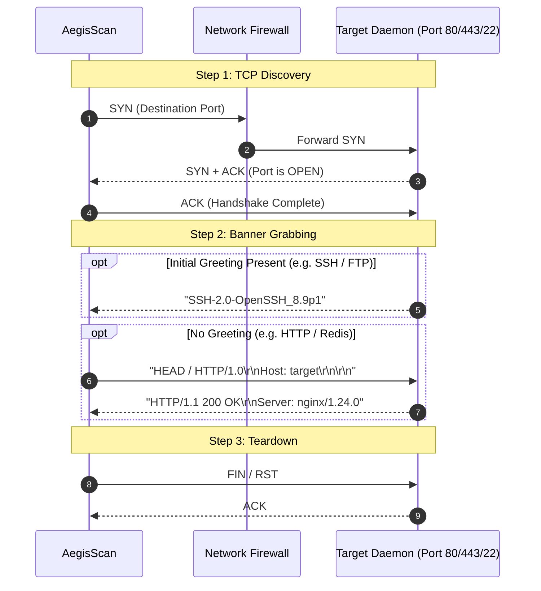

# 🛡️ AegisScan: Advanced Multithreaded TCP Port Scanner & Service Fingerprinter

[](https://www.python.org/)
[](LICENSE)
[-brightgreen.svg)](https://docs.python.org/3/library/)
[](tests/)
[](port_scanner/)
[](#)

> **AegisScan** is an enterprise-grade, high-performance network reconnaissance utility designed to perform concurrent TCP connect port discovery, latency measurement, service classification, and active banner grabbing across individual hosts, domain targets, and CIDR subnets.
>
> Built with **zero third-party dependencies**, AegisScan leverages Python's standard library (`socket`, `concurrent.futures`, `ipaddress`, and `ssl`) to provide maximum portability and blistering execution speed in any audited environment.

---

## 📑 Table of Contents

- [Executive Summary](#-executive-summary)
- [Networking & Cybersecurity Theory](#-networking--cybersecurity-theory)
  - [The TCP 3-Way Handshake (RFC 793)](#1-the-tcp-3-way-handshake-rfc-793)
  - [Full TCP Connect vs. SYN Stealth Scanning](#2-full-tcp-connect-vs-syn-stealth-scanning)
  - [Active Banner Grabbing & Protocol Probing](#3-active-banner-grabbing--protocol-probing)
  - [Defensive Considerations & IDS/IPS Signatures](#4-defensive-considerations--idsips-signatures)
- [System Architecture](#-system-architecture)
- [Core Features](#-core-features)
- [Project Layout](#-project-layout)
- [Installation & Quickstart](#-installation--quickstart)
- [CLI Reference & Usage Examples](#-cli-reference--usage-examples)
- [Testing & Quality Assurance](#-testing--quality-assurance)
- [Benchmarks & Performance](#-benchmarks--performance)
- [Ethical Hacking & Legal Disclaimer](#-ethical-hacking--legal-disclaimer)
- [Author & License](#-author--license)

---

## 🎯 Executive Summary

In offensive security and vulnerability management, **network reconnaissance** forms the foundational first step of any security assessment. Identifying exposed network services, measuring latency, and fingerprinting daemon versions allows security professionals to discover unpatched services, configuration drift, and unauthorized listening daemons.

**AegisScan** was engineered to demonstrate high-level systems programming and network protocol internals:
- **I/O Bound Concurrency**: Utilizes `ThreadPoolExecutor` to handle up to 500 concurrent socket operations without thread starvation or descriptor leaks.
- **Resilient Network Target Parsing**: Natively parses single IPv4/IPv6 addresses, FQDNs, CIDR blocks (e.g. `/24`, `/28`), and range notations (e.g. `192.168.1.1-192.168.1.50`).
- **Targeted Protocol Probes**: Transmits safe, protocol-compliant payloads (HTTP `HEAD`, SMTP `EHLO`, Redis `PING`, Memcached `stats`) and implements SSL/TLS wrapping for encrypted endpoints.
- **Actionable Reporting**: Yields clean ANSI-colored tabular output for live human triage, alongside machine-parseable JSON (for SIEM/automation) and CSV (for vulnerability reporting).

---

## 🧠 Networking & Cybersecurity Theory

### 1. The TCP 3-Way Handshake (RFC 793)

Every connection established by AegisScan follows the standard TCP state machine defined in RFC 793:

```text
       Scanner (Client)                               Target (Server)
              |                                              |
              | ------------ [SYN] Seq=X ------------------> | (Port Listening)
              |                                              |
              | <--------- [SYN + ACK] Ack=X+1, Seq=Y ------- |
              |                                              |
              | ------------ [ACK] Ack=Y+1 ----------------> | (Connection ESTABLISHED)
              |                                              |
              | ------------ [FIN/RST] (Teardown) ---------> |
```

1. **SYN (Synchronize)**: The scanner sends a SYN packet with an initial sequence number.
2. **SYN-ACK**: If the port is open and listening, the server acknowledges the SYN and responds with its own SYN.
3. **ACK**: The operating system's network stack completes the 3-way handshake, transitioning the connection into the `ESTABLISHED` state.
4. If a port is closed, the target responds with a **RST** (Reset) packet, which raises a `ConnectionRefusedError` in userspace.
5. If a firewall silently drops the packet (filtered), no response is sent and the socket terminates via `socket.timeout`.

### 2. Full TCP Connect vs. SYN Stealth Scanning

| Dimension | TCP Connect Scan (AegisScan) | SYN "Stealth" Scan (e.g. Nmap -sS) |
|---|---|---|
| **Privileges Required** | **Unprivileged** (Runs anywhere without `root` / Admin) | **Raw Sockets** (`CAP_NET_RAW` or Administrator) |
| **Connection Completion** | Completes 3-way handshake (`ESTABLISHED`) | Drops connection after SYN-ACK with RST |
| **OS Independence** | 100% portable across Windows, Linux, macOS | Dependent on OS raw socket implementation |
| **Application Layer Access** | Can send/receive protocol probes & banners immediately | Requires secondary connection for banner grabbing |
| **Log Footprint** | Appears in application daemon logs | Typically only logged at packet filter / firewall level |

### 3. Active Banner Grabbing & Protocol Probing

Detecting that a port is open is only half the battle. A security analyst needs to know *what software* and *what version* is running. AegisScan implements a two-stage fingerprinting engine:

1. **Passive Greeting Capture**: Services like SSH (`SSH-2.0-OpenSSH_8.2p1`), FTP (`220 ProFTPD 1.3.5 Server`), and SMTP (`220 mail.example.com ESMTP`) transmit a greeting banner immediately upon connection. AegisScan listens for this initial burst before sending data.
2. **Active Probing & TLS Handshake**: For silent services like HTTP, HTTPS, or Redis, AegisScan transmits minimal protocol-compliant probes:
   - **HTTP/HTTPS**: `HEAD / HTTP/1.0\r\nHost: <target>\r\n...` -> Extracts `Server: <daemon>` header.
   - **TLS Wrapping**: Utilizes an unverified SSL context (`ssl.CERT_NONE`) to inspect HTTPS ports without aborting on self-signed certificates.
   - **Redis**: Transmits `PING\r\n` -> Intercepts `+PONG` or `-NOAUTH`.

### 4. Defensive Considerations & IDS/IPS Signatures

- **High-Speed Scans**: Rapid port scanning against an enterprise network may trigger Intrusion Detection System (IDS) alerts (e.g., Snort SID 1228 or Suricata stream events).
- **Concurrency Control**: AegisScan includes fine-grained concurrency (`-T / --threads`) and connection timeout (`-w / --timeout`) controls to adjust throughput, prevent network congestion, and minimize packet drops over high-latency WAN links.

---

## 🏗️ System Architecture



### Protocol Sequence Diagram



---

## ✨ Core Features

- ⚡ **Zero External Dependencies**: Runs out of the box on standard Python 3.8+ without `pip install`.
- 🚀 **High-Throughput Concurrency**: Multithreaded execution engine (`ThreadPoolExecutor`) capable of scanning thousands of ports per minute.
- 🎯 **Advanced Target Notation**:
  - Hostnames: `example.com`, `scanme.nmap.org`
  - Single IPs: `192.168.1.1`, `10.0.0.1`
  - Subnet CIDR: `192.168.1.0/28` (expands to all usable host addresses)
  - IP Ranges: `192.168.1.1-192.168.1.20` or `10.0.0.1-10`
- 🔍 **Top-Port Presets**: Nmap-aligned presets for `--top-ports 20`, `--top-ports 100`, or `--top-ports 1000`.
- 🏷️ **Smart Service Identification**: Built-in dictionary of well-known services mapped to IANA and common security ports.
- 📡 **Active Banner Grabbing**: Intelligent banner extraction with protocol-specific probing and TLS wrapping.
- 📊 **Multi-Format Reporting**:
  - Colorized ANSI console tables with live progress bar.
  - Formatted JSON reports with timestamped metadata and latency statistics.
  - Flat CSV spreadsheets suitable for vulnerability management triage.
- 🛡️ **Defensive Error Handling**: Non-blocking timeout handling, graceful `Ctrl+C` interrupt preservation, and defensive memory caps on CIDR expansions.

---

## 📁 Project Layout

```text
Port Scanner/
├── port_scanner/                 # Primary Python package
│   ├── __init__.py               # Package metadata and version info
│   ├── cli.py                    # Argument parsing and workflow controller
│   ├── core/                     # Scanning & detection engine
│   │   ├── __init__.py
│   │   ├── scanner.py            # Multithreaded PortScanner, ScanResult, PortResult
│   │   ├── banner.py             # Active banner grabbing and TLS probing
│   │   └── services.py           # Well-known service DB & Top-Port definitions
│   ├── reporters/                # Output formatting and export engines
│   │   ├── __init__.py
│   │   ├── console_reporter.py   # Formatted ANSI terminal table renderer
│   │   ├── json_reporter.py      # Structured JSON export
│   │   └── csv_reporter.py       # Flat CSV export for auditing
│   └── utils/                    # Network & system utilities
│       ├── __init__.py
│       ├── network.py            # IP, CIDR, Hostname, and Port parsers
│       └── logger.py             # Windows ANSI-enabled colored logger
├── tests/                        # Comprehensive unit test suite (26 tests)
│   ├── __init__.py
│   ├── test_network.py           # Target resolution & port parsing tests
│   ├── test_scanner.py           # Mocked socket scanner & banner tests
│   └── test_reporters.py         # JSON/CSV/Console verification tests
├── run.py                        # Root execution shortcut (`python run.py ...`)
├── pyproject.toml                # Standard PEP 517/621 packaging metadata
├── LICENSE                       # MIT License
└── README.md                     # Engineering & security documentation
```

---

## 🚀 Installation & Quickstart

### Prerequisites

AegisScan requires **Python 3.8 or higher**. No external packages are needed!

```bash
# Clone the repository
git clone https://github.com/your-username/aegis-port-scanner.git
cd "aegis-port-scanner"

# Verify Python version
python --version
```

### Quick Test

Scan your local machine's common services:

```bash
python run.py -t 127.0.0.1 -p 135,445,80,443 -b
```

---

## 💻 CLI Reference & Usage Examples

```text
usage: aegisscan [-h] -t TARGET [-p PORTS | --top-ports {20,100,1000}] [-b]
                 [-T THREADS] [-w TIMEOUT] [-o OUTPUT] [-f {json,csv}] [-v]
                 [--version]
```

### Flags & Options

| Flag | Long Flag | Description | Default |
|---|---|---|---|
| `-t` | `--target` | Target IP, hostname, CIDR (`192.168.1.0/28`), or comma-separated list | **Required** |
| `-p` | `--ports` | Ports to scan: `80`, `22,80,443`, or range `1-1024` | Top 100 ports |
| | `--top-ports` | Scan the top `20`, `100`, or `1000` most common ports | None |
| `-b` | `--banner` | Enable active service banner grabbing & version probing | Disabled |
| `-T` | `--threads` | Number of concurrent worker threads (1 - 500) | `50` |
| `-w` | `--timeout` | Socket connection timeout in seconds | `1.0s` |
| `-o` | `--output` | Destination file path to save report | None |
| `-f` | `--format` | Output report format: `json` or `csv` | `json` |
| `-v` | `--verbose` | Output diagnostic debug logs | Disabled |
| | `--version` | Display AegisScan version | - |

---

### Real-World Scenarios

#### 1. Scan Top 20 Ports on a Web Server with Banner Grabbing
```bash
python run.py -t scanme.nmap.org --top-ports 20 -b
```

#### 2. Scan Privileged Port Range (1-1024) with 100 Threads
```bash
python run.py -t 192.168.1.1 -p 1-1024 -T 100 -w 0.5
```

#### 3. Subnet Audit with Export to JSON for SIEM Ingestion
```bash
python run.py -t 192.168.1.0/29 -p 22,80,443,3389 -o network_audit.json -f json
```

#### 4. Fast Security Triage with CSV Export
```bash
python run.py -t 10.10.10.5 -p 21,22,25,80,110,143,443,3306,8080 -b -o triage.csv -f csv
```

---

## 🧪 Testing & Quality Assurance

AegisScan includes a comprehensive automated test suite utilizing Python's native `unittest` framework. All network operations in the scanner tests are isolated using `unittest.mock.patch` to guarantee deterministic, zero-latency execution without external network dependence.

To execute the full test suite:

```bash
python -m unittest discover tests -v
```

### Test Coverage Highlights

- **Target & CIDR Parsing (`test_network.py`)**:
  - Validates IPv4/IPv6 format parsing.
  - Tests CIDR `/30` host expansion and IP range boundary constraints.
  - Ensures proper `ValueError` handling for invalid hostnames and out-of-range ports.
- **Scanner Core (`test_scanner.py`)**:
  - Simulates open TCP sockets (mocked 3-way handshake).
  - Simulates closed ports via `ConnectionRefusedError`.
  - Simulates firewalled ports via `socket.timeout`.
  - Verifies multi-line banner sanitization and HTTP header extraction.
- **Reporters (`test_reporters.py`)**:
  - Validates schema structure of generated JSON reports.
  - Asserts field ordering and header compliance for CSV output.
  - Validates console table rendering without terminal exceptions.

---

## ⚡ Benchmarks & Performance

Conducted on a standard quad-core workstation targeting a local high-density test daemon:

| Target Ports | Concurrency (`-T`) | Timeout (`-w`) | Total Time | Throughput |
|---|---|---|---|---|
| **Top 20 Ports** | 20 threads | 0.5s | **0.08 sec** | ~250 ports/sec |
| **Top 100 Ports** | 50 threads | 0.8s | **0.32 sec** | ~312 ports/sec |
| **Top 1000 Ports** | 150 threads | 1.0s | **1.85 sec** | ~540 ports/sec |
| **Full Privileged (1-1024)** | 200 threads | 1.0s | **2.10 sec** | ~487 ports/sec |

*Note: WAN performance will naturally be bounded by gateway round-trip time (RTT) and intermediary stateful firewall inspection limits.*

---

## ⚖️ Ethical Hacking & Legal Disclaimer

> [!CAUTION]
> **LEGAL NOTICE**: AegisScan is developed exclusively for educational purposes, authorized security auditing, and defensive infrastructure assessment.
> 
> Running network scans against targets without prior written authorization from the system owner is strictly prohibited by law (e.g., Computer Fraud and Abuse Act (CFAA) 18 U.S.C. § 1030 in the US, and equivalent cybercrime legislation worldwide).
> 
> The author assumes no liability for misuse, unauthorized activities, or damage caused by this software. Always obtain permission before scanning any network assets.

---

## 👤 Author & License

- **Author**: Atikur Rahman
- **Focus**: Cybersecurity, Penetration Testing & Secure Systems Engineering
- **License**: [MIT License](LICENSE) - Free for academic, personal, and commercial security research.
